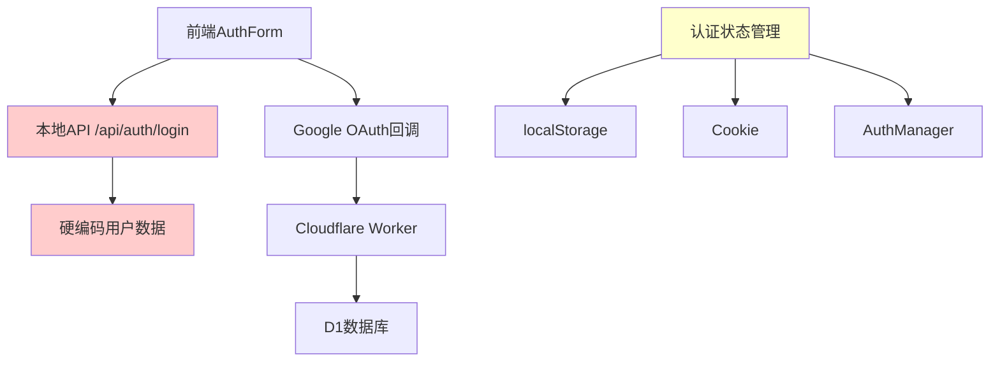
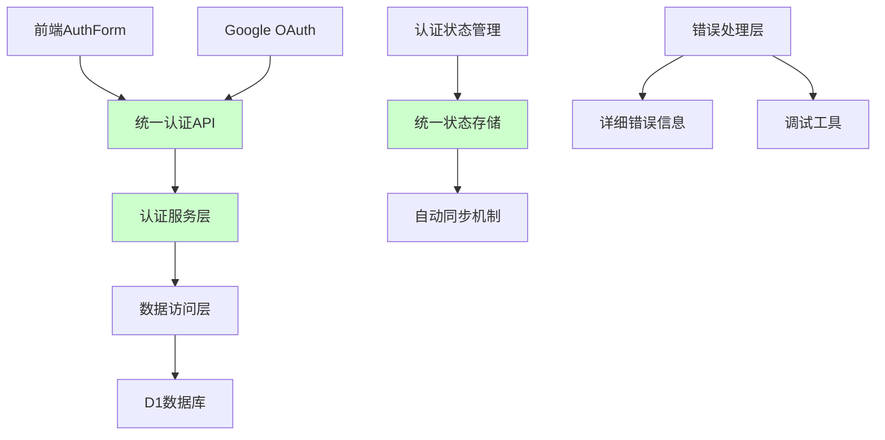

# 认证系统修复设计文档

## 概述

本设计文档旨在解决当前认证系统中的两个关键问题：用户名密码登录失败和Google OAuth登录失败。通过分析现有代码，我们发现了几个关键问题：

1. **架构不一致性**：应用同时使用本地API路由和Cloudflare Worker，导致认证流程混乱
2. **数据源不匹配**：本地API使用硬编码用户数据，而Worker使用D1数据库
3. **错误处理不完善**：缺乏详细的错误信息和调试能力
4. **状态同步问题**：前端认证状态管理复杂且容易出现不一致

## 架构

### 当前架构问题



### 目标架构



## 组件和接口

### 1. 统一认证服务 (AuthenticationService)

**职责**：
- 处理所有认证请求（密码登录、Google OAuth）
- 统一错误处理和响应格式
- 管理JWT令牌生命周期

**接口**：
```typescript
interface AuthenticationService {
  // 用户名密码登录
  loginWithPassword(email: string, password: string): Promise<AuthResult>
  
  // Google OAuth登录
  loginWithGoogle(googleToken: string, email: string): Promise<AuthResult>
  
  // 注册用户
  registerUser(userData: UserRegistrationData): Promise<AuthResult>
  
  // 验证令牌
  verifyToken(token: string): Promise<TokenValidationResult>
  
  // 刷新令牌
  refreshToken(token: string): Promise<AuthResult>
}

interface AuthResult {
  success: boolean
  token?: string
  user?: UserInfo
  error?: AuthError
}

interface AuthError {
  code: string
  message: string
  details?: any
  debugInfo?: any
}
```

### 2. 数据访问层 (UserRepository)

**职责**：
- 统一数据库访问接口
- 处理用户数据的CRUD操作
- 支持本地开发和生产环境

**接口**：
```typescript
interface UserRepository {
  // 根据邮箱查找用户
  findByEmail(email: string): Promise<User | null>
  
  // 创建新用户
  createUser(userData: CreateUserData): Promise<User>
  
  // 更新用户信息
  updateUser(userId: string, updates: Partial<User>): Promise<User>
  
  // 验证用户凭据
  validateCredentials(email: string, password: string): Promise<boolean>
}

interface User {
  id: string
  name: string
  email: string
  password?: string
  isGoogleUser: boolean
  points: number
  createdAt: Date
  updatedAt: Date
}
```

### 3. 前端认证管理器 (UnifiedAuthManager)

**职责**：
- 统一管理前端认证状态
- 自动同步localStorage和Cookie
- 提供React Hook接口

**接口**：
```typescript
interface UnifiedAuthManager {
  // 获取当前认证状态
  getAuthState(): AuthState
  
  // 登录
  login(credentials: LoginCredentials): Promise<void>
  
  // 登出
  logout(): Promise<void>
  
  // 刷新认证状态
  refreshAuth(): Promise<void>
  
  // 订阅状态变化
  subscribe(callback: (state: AuthState) => void): () => void
}

interface AuthState {
  isAuthenticated: boolean
  user: UserInfo | null
  token: string | null
  loading: boolean
  error: string | null
}
```

### 4. 错误处理系统 (AuthErrorHandler)

**职责**：
- 标准化错误响应格式
- 提供用户友好的错误消息
- 支持开发环境调试

**接口**：
```typescript
interface AuthErrorHandler {
  // 处理认证错误
  handleAuthError(error: any, context: string): AuthError
  
  // 获取用户友好的错误消息
  getUserMessage(errorCode: string, locale: string): string
  
  // 记录调试信息
  logDebugInfo(error: any, context: any): void
}

enum AuthErrorCode {
  INVALID_CREDENTIALS = 'INVALID_CREDENTIALS',
  USER_NOT_FOUND = 'USER_NOT_FOUND',
  EMAIL_ALREADY_EXISTS = 'EMAIL_ALREADY_EXISTS',
  GOOGLE_AUTH_FAILED = 'GOOGLE_AUTH_FAILED',
  TOKEN_EXPIRED = 'TOKEN_EXPIRED',
  DATABASE_ERROR = 'DATABASE_ERROR',
  NETWORK_ERROR = 'NETWORK_ERROR',
  CONFIGURATION_ERROR = 'CONFIGURATION_ERROR'
}
```

## 数据模型

### 用户表结构优化

```sql
CREATE TABLE IF NOT EXISTS users (
  id INTEGER PRIMARY KEY AUTOINCREMENT,
  name TEXT NOT NULL,
  email TEXT UNIQUE NOT NULL,
  password TEXT, -- 可选，Google用户可能没有密码
  is_google_user INTEGER DEFAULT 0,
  google_id TEXT, -- Google用户ID
  points INTEGER DEFAULT 50,
  status TEXT DEFAULT 'active', -- active, suspended, deleted
  created_at TIMESTAMP DEFAULT CURRENT_TIMESTAMP,
  updated_at TIMESTAMP DEFAULT CURRENT_TIMESTAMP,
  last_login_at TIMESTAMP
);

-- 添加索引
CREATE INDEX IF NOT EXISTS idx_users_email ON users(email);
CREATE INDEX IF NOT EXISTS idx_users_google_id ON users(google_id);
```

### 认证会话表

```sql
CREATE TABLE IF NOT EXISTS auth_sessions (
  id INTEGER PRIMARY KEY AUTOINCREMENT,
  user_id INTEGER NOT NULL,
  token_hash TEXT NOT NULL,
  expires_at TIMESTAMP NOT NULL,
  created_at TIMESTAMP DEFAULT CURRENT_TIMESTAMP,
  last_used_at TIMESTAMP DEFAULT CURRENT_TIMESTAMP,
  user_agent TEXT,
  ip_address TEXT,
  FOREIGN KEY (user_id) REFERENCES users(id)
);

CREATE INDEX IF NOT EXISTS idx_sessions_token ON auth_sessions(token_hash);
CREATE INDEX IF NOT EXISTS idx_sessions_user ON auth_sessions(user_id);
```

## 错误处理

### 错误分类和处理策略

1. **用户输入错误**
   - 无效邮箱格式
   - 密码为空
   - 处理：前端验证 + 后端验证，返回具体错误信息

2. **认证失败错误**
   - 用户不存在
   - 密码错误
   - Google令牌无效
   - 处理：返回通用"认证失败"消息（安全考虑），记录详细日志

3. **系统错误**
   - 数据库连接失败
   - JWT密钥缺失
   - 外部服务不可用
   - 处理：返回通用错误消息，记录详细错误日志，触发告警

4. **配置错误**
   - 环境变量缺失
   - Google OAuth配置错误
   - 处理：开发环境显示详细信息，生产环境记录日志

### 错误响应格式

```typescript
interface ErrorResponse {
  success: false
  error: {
    code: string
    message: string
    timestamp: string
    requestId?: string
    debugInfo?: any // 仅开发环境
  }
}
```

## 测试策略

### 单元测试

1. **认证服务测试**
   - 密码验证逻辑
   - JWT令牌生成和验证
   - Google令牌验证

2. **数据访问层测试**
   - 用户查询和创建
   - 数据库连接处理
   - 错误场景处理

3. **前端状态管理测试**
   - 认证状态同步
   - 本地存储管理
   - 错误状态处理

### 集成测试

1. **完整登录流程测试**
   - 用户名密码登录
   - Google OAuth登录
   - 错误场景测试

2. **跨组件状态同步测试**
   - 多标签页同步
   - 页面刷新状态恢复
   - 自动登出处理

### 端到端测试

1. **用户体验测试**
   - 完整注册登录流程
   - 错误消息显示
   - 页面跳转和状态保持

## 性能优化

### 1. 认证缓存策略

- JWT令牌本地缓存，减少服务器验证请求
- 用户信息缓存，避免重复数据库查询
- 合理设置缓存过期时间

### 2. 数据库优化

- 添加必要的数据库索引
- 使用连接池管理数据库连接
- 实现查询结果缓存

### 3. 网络优化

- 实现请求重试机制
- 添加请求超时处理
- 使用适当的HTTP缓存头

## 安全考虑

### 1. 密码安全

- 使用强哈希算法（bcrypt或Argon2）
- 实现密码强度验证
- 防止密码暴力破解

### 2. JWT安全

- 使用强随机密钥
- 设置合理的过期时间
- 实现令牌刷新机制
- 支持令牌撤销

### 3. OAuth安全

- 验证OAuth回调来源
- 使用HTTPS传输
- 实现CSRF保护

### 4. 数据保护

- 敏感数据加密存储
- 实现访问日志记录
- 定期清理过期会话

## 监控和调试

### 1. 日志记录

- 结构化日志格式
- 不同级别的日志记录
- 敏感信息脱敏

### 2. 性能监控

- 认证请求响应时间
- 数据库查询性能
- 错误率统计

### 3. 调试工具

- 开发环境调试面板
- 认证状态检查工具
- 错误重现工具